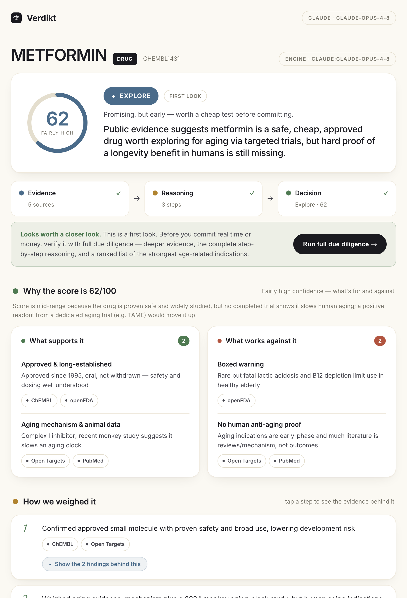

# Verdikt — the Evidence-to-Decision Engine

**Type in one thing — a drug, a gene, or a disease linked to aging — and Verdikt reads five
public science databases, shows its work step by step, and answers three questions:
*Is this worth pursuing? How sure can we be? What do we still not know?* — with a link behind
every claim.**

It’s built for **aging & longevity** research triage. Its whole personality is honesty: instead
of sounding confident, it deliberately hunts for where the evidence *disagrees* and gives a
**calibrated confidence score** you can trust.

> ⚠️ **For research triage only — not medical advice, and not a final decision.** Verdikt reasons
> only from public data; it cannot see internal PK, toxicity, patents, or commercial data.

No vector DB, no embeddings, no RAG, no fine-tuning, no GPU. Just five free APIs and Claude as
the reasoning engine.

---

## What it looks like

<!-- Add a screenshot here after your first run, e.g.:

-->

- **One search bar.** Type `metformin`, press enter.
- **Confirm step (human in the loop).** Verdikt shows what it thinks you mean (`metformin` → the
  drug) with alternatives, so the answer is about the right thing.
- **A live pipeline.** Watch the work happen: **Evidence → Reasoning → Decision**, each source
  lighting up as it’s queried.
- **A calm, transparent brief.** A big color-coded confidence dial, a plain-English verdict
  (*Pursue / Explore / Partner / Pause / Kill* — each shown with its meaning), a **“Why the score
  is 58/100”** panel showing what pushes it up ↑ and down ↓, and reasoning steps you can **tap to
  open** and see the exact evidence behind each one.
- **Two tiers.** Every search gives a fast, cheap **First look**. When a candidate looks worth it,
  one click runs **Full due diligence** — deeper reasoning plus a ranked list of the best
  age-related indications. Results are cached, so a repeat is instant and ~free.

---

## Quickstart

```bash
# 1. Install
pip install -r requirements.txt

# 2. Add your Claude key (get one at https://console.anthropic.com)
cp .env.example .env
#   then edit .env and paste your key after ANTHROPIC_API_KEY=

# 3. Run
python -m uvicorn verdikt.server:app --port 8123
#   open http://127.0.0.1:8123
```

Without a Claude key the app still runs on a transparent **rule-based fallback** (clearly labelled),
so you can try the whole UI first and add the key later for calibrated, reasoned briefs.

**Optional keys** (both sources work without them, just at lower rate limits): `NCBI_API_KEY`
(PubMed) and `OPENFDA_API_KEY` — add them to `.env` too.

### Command line / no server

```bash
python -m scripts.prove_metformin metformin   # or TP53, osteoarthritis, rapamycin, senolytics
python -m tests.test_answer_key               # scorecard vs a known answer key
```

---

## Deploy a live demo (shareable URL)

This is a Python web app, so it needs a host that runs Python — **GitHub Pages will not work**
(it only serves static files, and your Claude key must stay server-side).

**Render (free, ~5 minutes):**
1. Push this repo to GitHub (this repo includes a `render.yaml` Blueprint).
2. Go to [render.com](https://render.com) → **New → Blueprint** → select this repo.
3. When prompted, paste your `ANTHROPIC_API_KEY` (stored as a secret, never in the repo).
4. Deploy → you get a public URL like `https://verdikt.onrender.com`.

The free tier sleeps after inactivity, so the first visit after idle takes ~30s to wake.

**Hugging Face Spaces (free, good for AI demos):** this repo includes a `Dockerfile`.
Create a new **Space** → SDK **Docker** → add your files, then set `ANTHROPIC_API_KEY` under the
Space's **Settings → Secrets**. The app serves on port 7860 (handled by the Dockerfile).

> 💸 **Heads-up:** hosting is free, but every investigation spends Claude tokens on *your* key.
> Set a spending limit in the Anthropic console and share the link with people you trust.

**Quick temporary link (no deploy):** run it locally, then expose it with a tunnel —
`npx cloudflared tunnel --url http://localhost:8123` (or `ngrok http 8123`) — you'll get a public
URL that works while your machine is running it. Good for a quick demo.

---

## How a request flows

1. **Resolve** — free text → the right entity + ID via Open Targets’ `search` (longevity *classes*
   like “senolytics” map to a representative agent, with a note).
2. **Confirm** — you pick the exact entity (human in the loop).
3. **Gather** — five sources are queried; each streams *what it checked* and *what it found*.
4. **Reason** — Claude reconciles agreeing vs. conflicting evidence, assigns a **calibrated**
   confidence score (genetics > clinical > mechanism > association > literature; failed trials and
   boxed warnings penalized), and writes the brief in plain English — showing its steps.
5. **Decide** — you get the call, the caveats, and a “Your call” note that’s saved into the export
   (Markdown / print-to-PDF).

---

## Architecture

```
verdikt/
  config.py          Env/.env config; slots for ANTHROPIC / NCBI / openFDA keys
  cache.py           Tiny disk cache — repeats are near-free, identical answers
  sources/
    base.py          Thin UNIFORM client (session, retries, throttle, memory+disk cache)
    opentargets.py   Anchor source: target–disease scores, genetics, tractability, drugs
    clinicaltrials.py  Trials incl. a dedicated pass to capture whyStopped for failures
    chembl.py        Compounds, mechanisms, potency (filtered tightly by target + type)
    pubmed.py        Literature volume + top papers (NCBI E-utilities)
    openfda.py       Approved indications + boxed warnings
  resolver.py        Free text → ChEMBL/Ensembl/EFO IDs; longevity concept aliases
  longevity.py       Aging vocabulary + age-related-disease mapping
  investigator.py    Deterministically gathers evidence; streams purpose + finding per source
  prompts.py         The separate "brain": PLANNER + ANALYST prompts (quick & deep), strict JSON
  agent.py           Orchestrates resolve → plan → gather → reason → brief (Claude or heuristic)
  renderer.py        Brief → Markdown export
  server.py          FastAPI + SSE streaming; /api/resolve, /api/investigate, /api/export
frontend/
  index.html         Single-page app (no build step): search → confirm → live pipeline → brief
scripts/prove_metformin.py   End-to-end CLI proof
tests/test_answer_key.py     Scores output against metformin / rapamycin / senolytics
```

### The reasoning engine is pluggable
`agent.build_reasoner()` returns a Claude-powered reasoner when `ANTHROPIC_API_KEY` is set, else a
transparent heuristic. Both are engine-agnostic enough that the answer-key test passes either way.

---

## Domain note: “aging” isn’t one disease
The databases don’t model “aging” directly, so Verdikt maps longevity targets/drugs to the
**age-related diseases** they touch — osteoarthritis, pulmonary fibrosis, sarcopenia, Alzheimer’s,
metabolic disease — and reasons about those.

---

## Data sources
[Open Targets](https://platform.opentargets.org) ·
[ClinicalTrials.gov](https://clinicaltrials.gov) ·
[ChEMBL](https://www.ebi.ac.uk/chembl) ·
[PubMed / NCBI E-utilities](https://www.ncbi.nlm.nih.gov/home/develop/api/) ·
[openFDA](https://open.fda.gov). All free. Please respect their terms and rate limits.

## License
[MIT](LICENSE). Built with [Claude](https://www.anthropic.com/claude).
